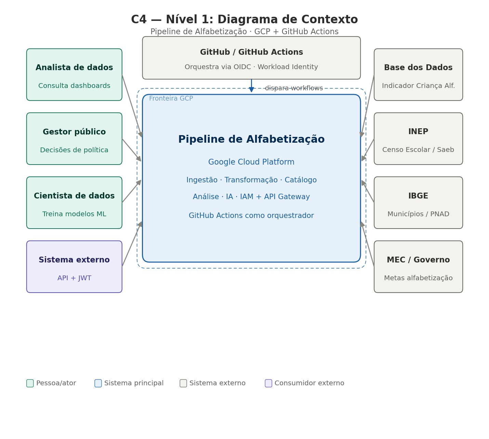
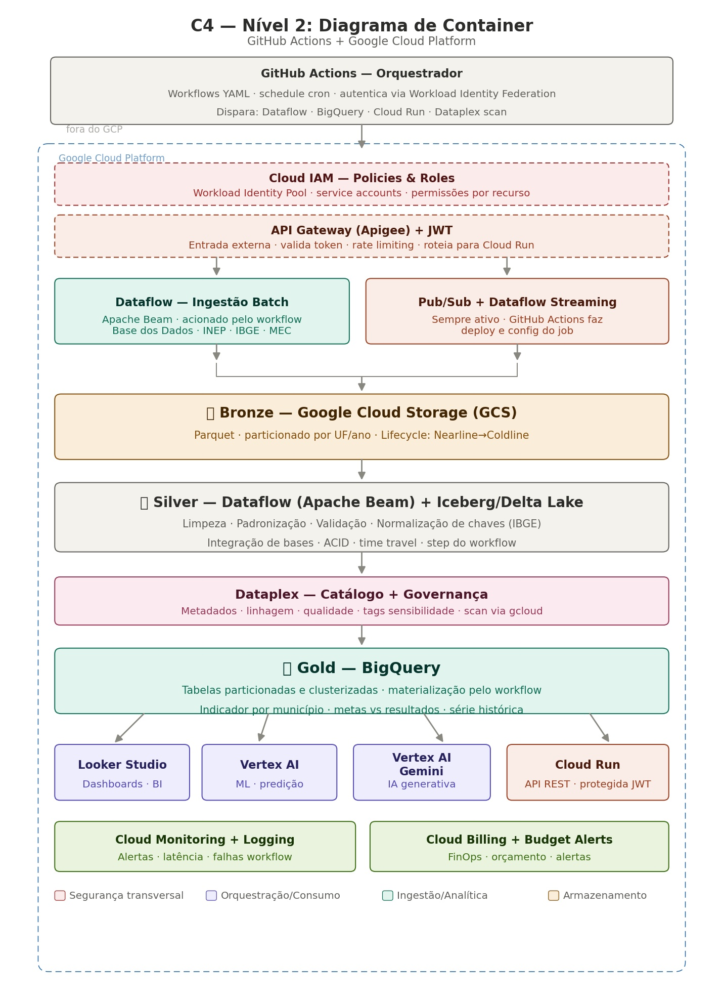

# Pipeline Híbrido para Análise da Alfabetização no Brasil

**Tech Challenge — Fase 2 | PosTech FIAP | IA Science**

---

## Contexto do Problema

A alfabetização na infância é um dos pilares fundamentais para o desenvolvimento educacional, social e econômico do Brasil. O **Compromisso Nacional Criança Alfabetizada** mobiliza União, estados, Distrito Federal e municípios com a meta de garantir que **todas as crianças brasileiras estejam alfabetizadas até o final do 2º ano do Ensino Fundamental até 2030**.

Para medir esse avanço, o INEP criou o **Indicador Criança Alfabetizada**, que expressa o percentual de estudantes que atingem **743 pontos na escala SAEB** — ponto de corte definido pela Pesquisa Alfabetiza Brasil (2023). Compreender os fatores que influenciam esse indicador exige integrar múltiplas fontes: metas nacionais, estaduais e municipais, microdados educacionais e dados territoriais.

---

## Arquitetura da Solução






```
┌─────────────────────────────────────────────────────────────┐
│           FONTE: Base dos Dados (BigQuery público)          │
│   basedosdados.br_inep_avaliacao_alfabetizacao              │
│   ├── uf                  ├── meta_alfabetizacao_brasil     │
│   ├── municipio           ├── meta_alfabetizacao_uf         │
│   ├── alunos              └── meta_alfabetizacao_municipio  │
└───────────────────┬─────────────────────────────────────────┘
                    │
        ┌───────────┴───────────┐
        │ INGESTÃO HÍBRIDA      │
        ├───────────────────────┤
        │  BATCH (periódico)    │  STREAMING (Pub/Sub)
        │  ingest_bronze.py     │  producer.py → consumer.py
        │  6 tabelas completas  │  eventos simulados em RT
        └───────────┬───────────┘
                    │
    ╔═══════════════▼═════════════════════╗
    ║  BRONZE — Dados Brutos (BigQuery)   ║
    ║  bronze.alfabetizacao_uf            ║
    ║  bronze.meta_brasil                 ║
    ║  bronze.meta_uf                     ║
    ║  bronze.meta_municipio              ║
    ║  bronze.alfabetizacao_municipio     ║
    ║  bronze.alunos                      ║
    ║  bronze.streaming_eventos           ║
    ╚═══════════════╦═════════════════════╝
                    ║ transform_silver.py
                    ║ dedup · filtro · normalização · integração
    ╔═══════════════▼═════════════════════╗
    ║  SILVER — Dados Tratados            ║
    ║  silver.alfabetizacao_uf_clean      ║
    ║  silver.metas_consolidadas          ║
    ║  silver.alfabetizacao_municipio_clean║
    ║  silver.alunos_clean                ║
    ╚═══════════════╦═════════════════════╝
                    ║ build_gold.py
                    ║ agregação · ranking · JOIN metas
    ╔═══════════════▼═════════════════════╗
    ║  GOLD — Camada Analítica            ║
    ║  gold.indicador_por_uf_ano          ║
    ║  gold.evolucao_temporal_brasil      ║
    ║  gold.ranking_estados               ║
    ║  gold.perfil_desempenho_uf          ║
    ║  gold.painel_municipios             ║
    ╚═════════════════════════════════════╝
                    │
            quality/validate.py
            checks bronze · silver · gold
```

---

## Fontes de Dados

| Tabela Bronze | Fonte Base dos Dados | Descrição |
|---|---|---|
| `alfabetizacao_uf` | `uf` + `dicionario` + diretório UF | Taxa por estado/série/rede |
| `meta_brasil` | `meta_alfabetizacao_brasil` | Metas nacionais 2024–2030 |
| `meta_uf` | `meta_alfabetizacao_uf` | Metas por estado 2024–2030 |
| `meta_municipio` | `meta_alfabetizacao_municipio` | Metas municipais 2024–2030 |
| `alfabetizacao_municipio` | `municipio` + `dicionario` | Taxa por município/série/rede |
| `alunos` | `alunos` + `dicionario` | Microdados individuais de alunos |

---

## Tecnologias Utilizadas

## 🛠️ Tecnologias Utilizadas

| Componente | Tecnologia | Justificativa |
|---|---|---|
| Cloud | **GCP** | Free tier generoso; BigQuery, Dataflow, Pub/Sub e Dataplex nativos e profundamente integrados |
| Orquestração | **GitHub Actions** | Gratuito para repositórios públicos; autentica no GCP via Workload Identity Federation sem chave de serviço armazenada |
| Ingestão batch | **Dataflow (Apache Beam)** | Serverless; mesmo código roda em modo batch e streaming, eliminando duplicação de lógica de processamento |
| Ingestão streaming | **Pub/Sub + Dataflow** | Pub/Sub entrega eventos garantidos e ordenados; Dataflow consome e processa sem servidor dedicado; 10 GB/mês no free tier |
| Data Lake (Bronze/Silver) | **Google Cloud Storage (GCS)** | Armazenamento de objetos mais barato que BigQuery ativo; Lifecycle automático move histórico para Nearline ($0,01/GB) e Coldline ($0,004/GB) |
| Formato tabular | **Apache Iceberg sobre GCS** | Transações ACID e time travel ilimitado sobre arquivos Parquet; formato aberto compatível com qualquer engine (Spark, Athena, BigQuery) |
| Transformação | **Dataflow (Apache Beam)** | Processa em paralelo sem gerenciar cluster; escala automaticamente conforme volume; reusa o mesmo runtime da ingestão |
| Catálogo de metadados | **Dataplex Catalog** | Descobre e cataloga automaticamente assets do GCS e BigQuery; mantém schema e linhagem centralizados sem esforço manual |
| Governança de dados | **Dataplex** | Define regras de qualidade, tags de sensibilidade e controle de zona (Bronze/Silver/Gold) de forma automatizada e auditável |
| Controle de acesso | **Cloud IAM** | Serviço transversal que define policies e roles para cada recurso do projeto; service accounts isolam permissões por serviço sem compartilhar credenciais |
| Data Warehouse | **BigQuery** | SQL serverless, 1 TB/mês grátis, sem VMs para gerenciar; tabelas particionadas por data e clusterizadas por UF reduzem custo de query na Gold |
| Query ad hoc | **BigQuery (serverless)** | Cobra por dado escaneado, não por cluster ativo; ideal para análises exploratórias pontuais sem custo fixo |
| BI / Dashboard | **Looker Studio** | Gratuito; conecta nativamente ao BigQuery sem ETL adicional; acessível a gestores sem conhecimento técnico |
| Machine Learning | **Vertex AI** | Lê direto do BigQuery sem exportar dados; unifica treino, deploy e monitoramento de modelos na mesma plataforma |
| IA Generativa | **Vertex AI Gemini** | Mesma plataforma do Vertex AI; acessa dados da Gold com a mesma governança e controle de acesso já configurados |
| Segurança de API externa | **API Gateway (Apigee) + JWT** | Única porta de entrada para sistemas externos; valida token antes de qualquer requisição chegar ao Cloud Run; aplica rate limiting sem alterar o backend |
| Backend de API | **Cloud Run** | Serverless; escala a zero quando sem requisições, zerando custo em períodos ociosos; recebe apenas requisições já validadas pelo Gateway |
| Monitoramento | **Cloud Monitoring + Cloud Logging** | Nativo do GCP; coleta métricas de todos os serviços sem instalar agentes; alertas configuráveis para falhas, latência e volume processado |
| FinOps | **Cloud Billing + Budget Alerts** | Visibilidade de custo por serviço e por camada; alertas automáticos antes de estourar orçamento; sem ferramenta adicional |
| Cold storage | **GCS Nearline / Coldline** | Transição automática via Lifecycle Policy; dados históricos da Bronze raramente acessados custam até 80% menos que storage padrão |
| Linguagem | **Python 3.11** | Bibliotecas maduras para GCP (google-cloud-bigquery, apache-beam, google-cloud-storage); padrão na engenharia de dados |

---

## Como Executar Localmente

### Pré-requisitos

1. Conta GCP com projeto `project-516b6700-5d68-403c-860`
2. APIs habilitadas: BigQuery API, Pub/Sub API
3. Service Account com roles:
   - `BigQuery Data Editor`
   - `BigQuery Job User`
   - `Pub/Sub Editor`
4. Arquivo JSON da service account salvo em `credentials/service-account.json`

### Setup

```bash
pip install -r requirements.txt
export GOOGLE_APPLICATION_CREDENTIALS="credentials/service-account.json"
```

### Executar pipeline completo

```bash
python run_pipeline.py
```

### Executar etapas individualmente

```bash
# Bronze
python ingestion/batch/ingest_bronze.py

# Silver
python silver/transform_silver.py

# Gold
python gold/build_gold.py

# Qualidade
python quality/validate.py --camada all
python quality/validate.py --camada bronze
python quality/validate.py --camada silver
python quality/validate.py --camada gold
```

### Streaming (2 terminais separados)

```bash
# Terminal 1 — consumidor (deve estar rodando antes do produtor)
python streaming/consumer.py --max-mensagens 20 --timeout 60

# Terminal 2 — produtor
python streaming/producer.py --eventos 20 --intervalo 1.0
```

---

## GitHub Actions — Configuração

O workflow `.github/workflows/pipeline.yml` executa o pipeline completo automaticamente toda segunda-feira às 6h UTC e pode ser disparado manualmente.

### Criando o secret `GCP_SA_KEY`

1. No GCP Console, baixe o JSON da service account
2. No repositório GitHub: **Settings → Secrets and variables → Actions → New repository secret**
3. Nome: `GCP_SA_KEY`
4. Valor: conteúdo completo do JSON

### Permissões da service account

```
roles/bigquery.dataEditor
roles/bigquery.jobUser
roles/pubsub.editor
```

---

---

## ⚖️ Decisões Arquiteturais e Trade-offs

### Batch vs Streaming

| | Batch | Streaming |
|---|---|---|
| **Quando** | Metas anuais · INEP · IBGE · histórico | Novos indicadores · alertas urgentes |
| **Custo** | Baixo — jobs sob demanda | Maior — infra contínua (Pub/Sub always-on) |
| **Latência** | Horas / dias | Segundos |
| **Implementação** | GitHub Actions cron agendado | Pub/Sub + Dataflow always-on |

**Decisão: pipeline híbrida.** Batch para 90% do volume (dados históricos e metas periódicas); streaming apenas para eventos de atualização de indicadores, onde latência importa.

---

### Data Lake vs Data Warehouse

| | Data Lake (GCS) | Data Warehouse (BigQuery) |
|---|---|---|
| **Schema** | Flexível · formato aberto (Parquet/Iceberg) | Rígido · tipado · otimizado para query |
| **Custo/GB** | $0,004 (Coldline) a $0,02 (Standard) | $0,02 (ativo) |
| **Uso** | Bronze e Silver | Gold |
| **Engine** | Qualquer (Spark, Beam, Athena) | BigQuery |

**Decisão: lakehouse (GCS + BigQuery).** GCS para armazenar barato nas camadas Bronze e Silver; BigQuery apenas para a Gold analítica. Melhor dos dois mundos: custo de data lake com performance de data warehouse onde importa.

---

### Custo vs Performance

| Decisão | Escolha | Impacto |
|---|---|---|
| Formato de arquivo | Parquet | Reduz I/O e armazenamento em até 80% vs CSV |
| Particionamento | Por UF e ano | Queries leem só a partição necessária |
| Clusterização | Por município | Reduz bytes escaneados em queries analíticas |
| Storage histórico | Nearline / Coldline | Até 80% mais barato que Standard para dados frios |
| Processamento | Dataflow serverless | Paga só pelo tempo de execução, sem cluster ocioso |
| Orquestração | GitHub Actions | Zero custo fixo vs Cloud Composer (~$300/mês) |
| Consultas analíticas | BigQuery on-demand | Paga por dado escaneado, não por cluster ligado |
| API externa | Cloud Run | Escala a zero — custo zero em períodos ociosos |

**Decisão: custo primeiro, performance onde importa.** Storage frio e serverless para dados históricos; particionamento e clusterização apenas na Gold, onde as queries analíticas exigem velocidade.

---

## 💰 FinOps

### Estimativa de Custo Mensal

| Serviço | Uso estimado | Custo estimado |
|---|---|---|
| Google Cloud Storage (Standard) | 10 GB Bronze ativo | ~$0,20 |
| Google Cloud Storage (Nearline) | 50 GB histórico recente | ~$0,50 |
| Google Cloud Storage (Coldline) | 200 GB histórico antigo | ~$0,80 |
| BigQuery (armazenamento) | 5 GB Gold | ~$0,10 |
| BigQuery (queries) | 50 GB escaneados/mês | ~$0,25 (1 TB grátis) |
| Dataflow | 10h de processamento batch/mês | ~$1,50 |
| Pub/Sub | 5 GB eventos/mês | Grátis (free tier 10 GB) |
| Cloud Run | 1M requisições/mês | Grátis (free tier) |
| GitHub Actions | Workflows públicos | Grátis |
| Cloud Monitoring | Métricas básicas | Grátis |
| **Total estimado** | | **~$3,35/mês** |

> Os custos acima consideram o free tier do GCP e um volume típico de dados educacionais públicos. Em produção com maior volume, o particionamento e o Coldline garantem escala sem crescimento linear de custo.

### Práticas adotadas

- **Parquet** em todas as camadas — reduz I/O e armazenamento em até 80% vs CSV
- **Lifecycle Policy no GCS** — move dados automaticamente para Nearline (30 dias) e Coldline (90 dias) sem intervenção manual
- **Particionamento e clusterização no BigQuery** — queries leem apenas o subconjunto necessário, reduzindo custo por query
- **Dataflow sob demanda** — jobs existem apenas durante a execução, sem cluster ocioso
- **Cloud Run** — escala a zero fora de uso, custo zero em períodos sem requisições
- **GitHub Actions** — orquestração gratuita, eliminando ~$300/mês do Cloud Composer
- **Budget Alerts** — alertas em 50%, 80% e 100% do orçamento mensal definido

---

## 🤖 Aplicação em IA

A camada Gold é o ponto de partida para análises avançadas e inteligência artificial:

| Caso de uso | Tecnologia | Descrição |
|---|---|---|
| **Predição de alfabetização** | Vertex AI | Modelo treinado sobre série histórica para prever municípios com risco de não atingir a meta de 2030 |
| **Clusters de vulnerabilidade** | Vertex AI | Segmentação de municípios por perfil educacional e socioeconômico combinado |
| **Detecção de anomalias** | Vertex AI | Identifica queda abrupta no indicador para ação preventiva de gestores |
| **Análise de desigualdade** | BigQuery + Looker Studio | Comparação temporal do indicador entre UFs e municípios |
| **Relatórios automáticos** | Vertex AI Gemini | Gera resumos executivos em linguagem natural a partir dos dados da Gold |
| **Políticas baseadas em dados** | BigQuery + API Gateway | Subsidia decisões de alocação de recursos do FUNDEB com evidências quantitativas |

---

## 📊 Monitoramento

| O que monitorar | Ferramenta | Alerta configurado |
|---|---|---|
| Falha em workflow do GitHub Actions | Cloud Monitoring + GitHub | Notificação imediata por e-mail |
| Latência de job Dataflow | Cloud Monitoring | Alerta se > 30 min |
| Volume de dados ingeridos | Cloud Logging | Alerta se < 80% do esperado |
| Falha de entrega no Pub/Sub | Cloud Monitoring | Alerta em dead-letter queue |
| Custo mensal | Cloud Billing | Alerta em 50%, 80% e 100% do budget |
| Qualidade de dados (Silver) | Dataplex | Alerta se regras de qualidade reprovam > 1% dos registros |

## Estrutura do Repositório

```
1IAST-Fase-2-Tech-Challenge/
├── .github/
│   └── workflows/
│       └── pipeline.yml          # CI/CD — execução semanal automática
├── ingestion/
│   └── batch/
│       └── ingest_bronze.py      # Ingestão de 6 tabelas → bronze
├── silver/
│   └── transform_silver.py       # 4 tabelas silver (limpeza + integração)
├── gold/
│   └── build_gold.py             # 5 tabelas analíticas gold
├── quality/
│   └── validate.py               # Validação das 3 camadas (exit 1 em falha)
├── streaming/
│   ├── producer.py               # Publica eventos no Pub/Sub
│   └── consumer.py               # Consome Pub/Sub → bronze.streaming_eventos
├── config.py                     # IDs do projeto GCP e datasets
├── run_pipeline.py               # Orquestrador local (batch sequential)
├── requirements.txt
└── README.md
```
