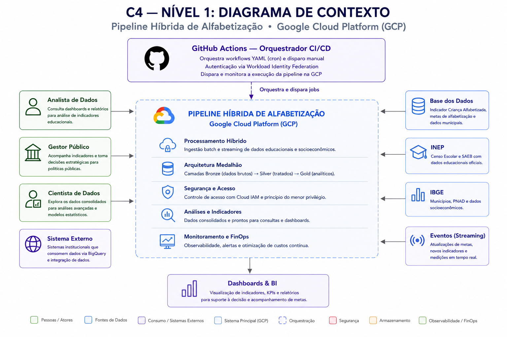
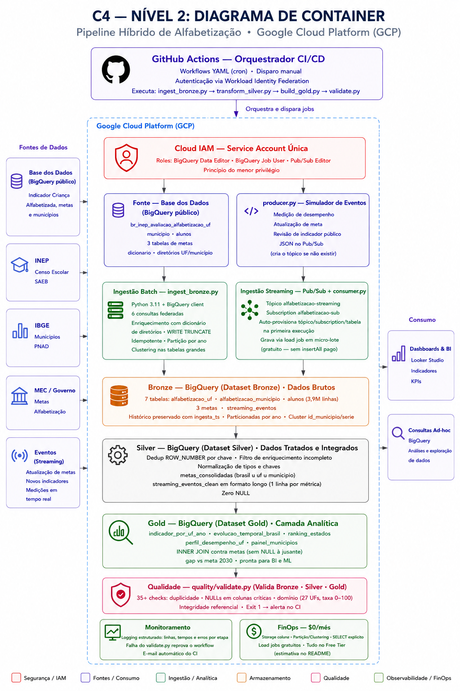
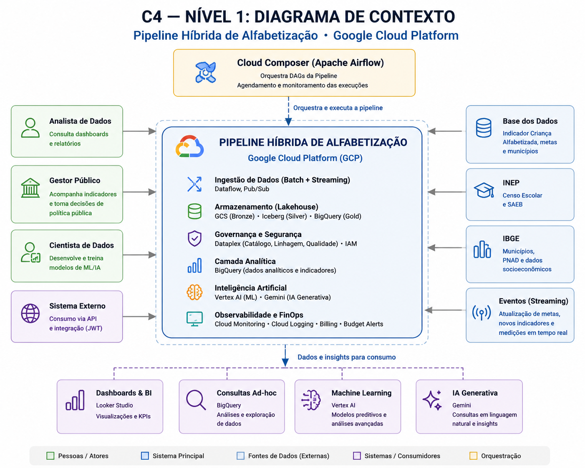
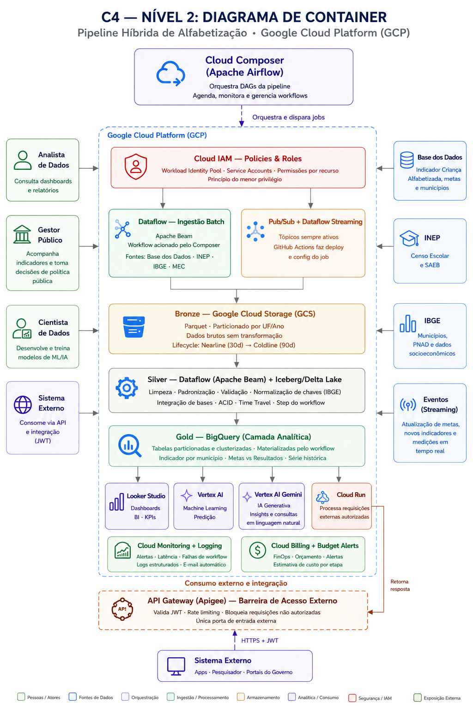

# Pipeline Híbrido para Análise da Alfabetização no Brasil

**Tech Challenge — Fase 2 | PosTech FIAP | IA Science**

## Sumário

- [Contexto do Problema](#contexto-do-problema)
- [Arquitetura AS-IS](#diagrama-de-contexto-as-is)
- [Arquitetura TO-BE](#diagrama-de-contexto-to-be)
- [Tecnologias Utilizadas](#️-tecnologias-utilizadas--as-is-vs-to-be)
- [Trade-offs](#️-decisões-arquiteturais-e-trade-offs)
- [FinOps](#-finops)
- [Qualidade de Dados](#-qualidade-de-dados--as-is-vs-to-be)
- [Monitoramento](#-monitoramento--as-is-vs-to-be)
- [Aplicação em IA](#-aplicação-em-ia)
- [Como Executar](#como-executar-localmente-a-arquitetura-as-is)
- [Estrutura do Repositório](#estrutura-do-repositório)
---

## Contexto do Problema

A alfabetização na infância é um dos pilares fundamentais para o desenvolvimento educacional, social e econômico do Brasil. O **Compromisso Nacional Criança Alfabetizada** mobiliza União, estados, Distrito Federal e municípios com a meta de garantir que **todas as crianças brasileiras estejam alfabetizadas até o final do 2º ano do Ensino Fundamental até 2030**.

Para medir esse avanço, o INEP criou o **Indicador Criança Alfabetizada**, que expressa o percentual de estudantes que atingem **743 pontos na escala SAEB** — ponto de corte definido pela Pesquisa Alfabetiza Brasil (2023). Compreender os fatores que influenciam esse indicador exige integrar múltiplas fontes: metas nacionais, estaduais e municipais, microdados educacionais e dados territoriais.

---

## Arquitetura da Solução

# Pipeline de Análise da Alfabetização no Brasil
## Tech Challenge — Fase 2 · PosTech FIAP

> **Nota arquitetural:** Este repositório contém duas visões da solução.
> - **AS-IS (esta seção):** arquitetura implementada e entregue, rodando 100% no free tier do GCP.
> - **TO-BE:** visão profissional de evolução, documentada na seção seguinte, representando
>   como a pipeline seria construída em um ambiente corporativo real.

---
---
## Diagrama de Contexto AS IS



## Diagrama de Container AS IS



## Diagrama de Contexto TO BE



## Diagrama de Container TO BE




## 📐 Arquitetura AS-IS (Implementada)

A pipeline implementada usa **BigQuery como plataforma única** para todas as
camadas (Bronze, Silver e Gold), com scripts Python orquestrados por GitHub
Actions. A escolha priorizou simplicidade de implementação e custo zero
dentro do free tier do GCP.


```
┌─────────────────────────────────────────────────────────────┐
│           FONTE: Base dos Dados (BigQuery público)          │
│   basedosdados.br_inep_avaliacao_alfabetizacao              │
│   ├── uf                  ├── meta_alfabetizacao_brasil     │
│   ├── municipio           ├── meta_alfabetizacao_uf         │
│   ├── alunos              └── meta_alfabetizacao_municipio  │
└───────────────────┬─────────────────────────────────────────┘
                    │
        ┌───────────┴───────────┐
        │ INGESTÃO HÍBRIDA      │
        ├───────────────────────┤
        │  BATCH (periódico)    │  STREAMING (Pub/Sub)
        │  ingest_bronze.py     │  producer.py → consumer.py
        │  6 tabelas completas  │  eventos simulados em RT
        └───────────┬───────────┘
                    │
    ╔═══════════════▼═════════════════════╗
    ║  BRONZE — Dados Brutos (BigQuery)   ║
    ║  bronze.alfabetizacao_uf            ║
    ║  bronze.meta_brasil                 ║
    ║  bronze.meta_uf                     ║
    ║  bronze.meta_municipio              ║
    ║  bronze.alfabetizacao_municipio     ║
    ║  bronze.alunos                      ║
    ║  bronze.streaming_eventos           ║
    ╚═══════════════╦═════════════════════╝
                    ║ transform_silver.py
                    ║ dedup · filtro · normalização · integração
    ╔═══════════════▼═════════════════════╗
    ║  SILVER — Dados Tratados            ║
    ║  silver.alfabetizacao_uf_clean      ║
    ║  silver.metas_consolidadas          ║
    ║  silver.alfabetizacao_municipio_clean║
    ║  silver.alunos_clean                ║
    ╚═══════════════╦═════════════════════╝
                    ║ build_gold.py
                    ║ agregação · ranking · JOIN metas
    ╔═══════════════▼═════════════════════╗
    ║  GOLD — Camada Analítica            ║
    ║  gold.indicador_por_uf_ano          ║
    ║  gold.evolucao_temporal_brasil      ║
    ║  gold.ranking_estados               ║
    ║  gold.perfil_desempenho_uf          ║
    ║  gold.painel_municipios             ║
    ╚═════════════════════════════════════╝
                    │
            quality/validate.py
            checks bronze · silver · gold
```

---

## Fontes de Dados

| Tabela Bronze | Fonte Base dos Dados | Descrição |
|---|---|---|
| `alfabetizacao_uf` | `uf` + `dicionario` + diretório UF | Taxa por estado/série/rede |
| `meta_brasil` | `meta_alfabetizacao_brasil` | Metas nacionais 2024–2030 |
| `meta_uf` | `meta_alfabetizacao_uf` | Metas por estado 2024–2030 |
| `meta_municipio` | `meta_alfabetizacao_municipio` | Metas municipais 2024–2030 |
| `alfabetizacao_municipio` | `municipio` + `dicionario` | Taxa por município/série/rede |
| `alunos` | `alunos` + `dicionario` | Microdados individuais de alunos |

---

---

## 🛠️ Tecnologias Utilizadas — AS-IS vs TO-BE

| Componente | AS-IS (Implementado) | Justificativa AS-IS | TO-BE (Visão Profissional) | Justificativa TO-BE |
|---|---|---|---|---|
| **Cloud** | **GCP** | Free tier generoso; BigQuery nativo e integrado; $0/mês viável | **GCP** | Ecossistema nativo; BigQuery, Dataflow, Pub/Sub e Cloud Composer integrados |
| **Orquestração** | **GitHub Actions** | Gratuito para repositórios públicos; cron semanal; autenticação via `GCP_SA_KEY`; sequência ingest → transform → build → validate em um único workflow | **Apache Airflow (Cloud Composer)** | DAGs com dependências complexas; retry automático por tarefa; visibilidade de falhas por etapa; padrão de mercado para pipelines de dados em produção |
| **Autenticação** | **Service account + GCP_SA_KEY** | Secret armazenado no repositório; roles mínimas: BigQuery Data Editor · Job User · Pub/Sub Editor — princípio do menor privilégio | **Workload Identity Federation** | Elimina chaves de serviço armazenadas como secret; tokens OIDC com escopo mínimo por job; sem risco de vazamento de credencial |
| **Ingestão batch** | **ingest_bronze.py (Python 3.11 + BigQuery client)** | 6 consultas federadas contra a Base dos Dados pública; WRITE_TRUNCATE garante idempotência; sem dependência de Dataflow ou Spark | **Dataflow (Apache Beam)** | Serverless; mesmo código roda em modo batch e streaming, eliminando duplicação de lógica; escala automaticamente conforme volume |
| **Ingestão streaming** | **producer.py + consumer.py (Pub/Sub)** | Simula eventos em tempo real; auto-provisiona tópico e subscription; grava via load job em micro-lote — gratuito, sem insertAll pago | **Pub/Sub + Dataflow Streaming** | Pub/Sub entrega eventos garantidos e ordenados; Dataflow consome sem servidor dedicado; 10 GB/mês no free tier |
| **Armazenamento Bronze/Silver** | **BigQuery dataset bronze/silver** | BigQuery puro elimina camadas intermediárias; free tier cobre o volume atual; partição e clustering reduzem custo de query | **Google Cloud Storage (GCS)** | Armazenamento de objetos mais barato; Lifecycle move histórico para Nearline ($0,01/GB) e Coldline ($0,004/GB) automaticamente |
| **Formato tabular** | **BigQuery nativo (colunar)** | Sem custo de conversão; compressão e particionamento nativos; adequado para o volume atual (~3,9M linhas) | **Apache Iceberg sobre GCS** | Transações ACID e time travel ilimitado sobre Parquet; formato aberto compatível com qualquer engine (Spark, Athena, BigQuery) |
| **Transformação** | **transform_silver.py (Python 3.11)** | Script Python com BigQuery client; dedup via ROW_NUMBER; normalização e integração de bases; sem custo de processamento externo | **Dataflow (Apache Beam)** | Processa em paralelo sem gerenciar cluster; escala automaticamente; reusa o mesmo runtime da ingestão batch |
| **Qualidade de dados** | **quality/validate.py** | 35+ checks nativos em Python + BigQuery; exit 1 reprova o workflow automaticamente; código auditável no repositório | **BigQuery SQL Assertions** | Validações nativas via SQL; sem dependência de frameworks externos; integradas ao engine dos dados; auditáveis via `INFORMATION_SCHEMA` |
| **Catálogo de dados** | **Logging Python + comentários no código** | Metadados documentados via logging estruturado e comentários nos scripts; sem custo adicional | **BigQuery Labels + Descriptions** | Metadados documentados direto nas tabelas via `ALTER TABLE SET OPTIONS`; pesquisáveis nativamente; sem custo adicional |
| **Controle de acesso** | **Cloud IAM (service account única)** | Roles mínimas por princípio do menor privilégio; sem chaves expostas no código | **Cloud IAM (service accounts por serviço)** | Service account isolada por serviço (Dataflow, Composer, Cloud Run); permissão mínima por componente; Workload Identity Federation elimina chaves |
| **Data Warehouse** | **BigQuery (Bronze + Silver + Gold)** | BigQuery como plataforma única; free tier cobre storage e queries no volume atual; partição e clustering reduzem bytes escaneados | **BigQuery (Gold)** | SQL serverless; 1 TB/mês grátis; tabelas particionadas por data e clusterizadas por UF e município na Gold |
| **Query ad hoc** | **BigQuery on-demand** | SELECT explícito em todas as queries; nunca `SELECT *`; 1 TB/mês grátis | **BigQuery (serverless)** | Cobra por dado escaneado, não por cluster ativo; clustering e particionamento reduzem custo por query |
| **BI / Dashboard** | **Não implementado** | Fora do escopo entregue — evolução futura (TO-BE) | **Looker Studio** | Gratuito; conecta nativamente ao BigQuery sem ETL adicional; acessível a gestores sem conhecimento técnico |
| **Machine Learning** | **Não implementado** | Fora do escopo entregue — evolução futura (TO-BE) | **Vertex AI** | Lê direto do BigQuery sem exportar dados; unifica treino, deploy e monitoramento de modelos na mesma plataforma |
| **IA Generativa** | **Não implementado** | Fora do escopo entregue — evolução futura (TO-BE) | **Vertex AI Gemini** | Mesma plataforma do Vertex AI; acessa dados da Gold com a mesma governança e controle de acesso já configurados |
| **Segurança de API externa** | **Não implementado** | Fora do escopo entregue — evolução futura (TO-BE) | **API Gateway (Apigee) + JWT** | Única porta de entrada para sistemas externos; valida token antes de qualquer requisição chegar ao Cloud Run; aplica rate limiting sem alterar o backend |
| **Backend de API** | **Não implementado** | Fora do escopo entregue — evolução futura (TO-BE) | **Cloud Run** | Serverless; escala a zero quando sem requisições, zerando custo em períodos ociosos; recebe apenas requisições já validadas pelo Gateway |
| **Monitoramento** | **logging Python + GitHub Actions** | Logging estruturado com linhas, tempos e erros por etapa; falha no `validate.py` reprova o workflow e envia e-mail automático do CI | **Cloud Monitoring + Cloud Logging** | Nativo do GCP; coleta métricas de todos os serviços sem instalar agentes; alertas configuráveis para falhas, latência e volume processado |
| **FinOps** | **BigQuery free tier** | Storage colunar nativo; partição e clustering reduzem bytes escaneados; SELECT explícito; load jobs gratuitos; $0/mês | **Cloud Billing + Budget Alerts** | Alertas em 50%, 80% e 100% do orçamento; visibilidade de custo por serviço e por camada; sem ferramenta adicional |
| **Cold storage** | **Não aplicável** | BigQuery gerencia ciclo de vida internamente; time travel de 7 dias no free tier | **GCS Nearline / Coldline** | Transição automática via Lifecycle Policy; histórico antigo custa até 80% menos que Standard |
| **Linguagem** | **Python 3.11** | Bibliotecas maduras para GCP (google-cloud-bigquery, google-cloud-pubsub); padrão na engenharia de dados | **Python 3.11** | Bibliotecas maduras para GCP (google-cloud-bigquery, apache-beam, google-cloud-storage); padrão na engenharia de dados |

> **Nota sobre orquestração:** o TO-BE substitui o GitHub Actions por **Apache Airflow via Cloud Composer** para orquestração da pipeline de dados. O GitHub Actions permanece no TO-BE apenas para **CI/CD** (testes, lint, deploy de código) — separando claramente a responsabilidade de orquestração de dados (Airflow) da entrega contínua de código (GitHub Actions). Essa separação é o padrão em engenharia de dados corporativa: o Airflow gerencia dependências entre tarefas de dados com retry granular, backfill histórico e visibilidade de DAGs; o GitHub Actions garante que o código que chega ao Airflow passou por validação automática.

---

## ⚖️ Decisões Arquiteturais e Trade-offs 

### Batch vs Streaming

| | Batch | Streaming |
|---|---|---|
| **Quando** | Metas anuais · INEP · IBGE · histórico | Novos indicadores · alertas urgentes · medições de desempenho |
| **Custo AS-IS** | Grátis — load jobs no free tier | Grátis — micro-lote via load job (sem insertAll pago) |
| **Custo TO-BE** | Baixo — Dataflow jobs sob demanda | Maior — Pub/Sub + Dataflow always-on |
| **Latência AS-IS** | Semanal (segunda 6h UTC) | Minutos — micro-lote Pub/Sub |
| **Latência TO-BE** | Horas / dias | Segundos |
| **Implementação AS-IS** | `ingest_bronze.py` · GitHub Actions cron | `producer.py` + `consumer.py` · Pub/Sub simulado |
| **Implementação TO-BE** | GitHub Actions cron + Dataflow Apache Beam | Pub/Sub + Dataflow Streaming always-on |
| **Idempotência** | `WRITE_TRUNCATE` garante reexecução segura | Load job em micro-lote evita duplicação |
| **Escalabilidade** | Adequada para volume atual (~3,9M linhas) | Ilimitada — Dataflow escala automaticamente |

**Decisão AS-IS:** pipeline híbrida com custo zero. Batch via script Python para o volume histórico; streaming simulado via Pub/Sub + consumer.py para demonstrar capacidade de ingestão de eventos em tempo real sem ultrapassar o free tier.

**Decisão TO-BE:** mesma lógica híbrida, com infraestrutura gerenciada. Batch para 90% do volume (dados históricos e metas periódicas); streaming real via Pub/Sub + Dataflow always-on apenas para eventos onde latência importa — evitando pagar por infraestrutura contínua para dados que chegam com baixa frequência.


---

### BigQuery puro vs Lakehouse (GCS + BigQuery)

| | AS-IS (BigQuery puro) | TO-BE (GCS + BigQuery) |
|---|---|---|
| **Complexidade** | Baixa — um serviço | Alta — dois serviços + Iceberg |
| **Custo** | $0/mês (free tier) | ~$3/mês |
| **Schema** | Rígido desde a Bronze | Flexível na Bronze/Silver |
| **Time travel** | 7 dias (BQ padrão) | Ilimitado (Iceberg) |
| **Reprocessamento** | Paga por query na Bronze | Lê GCS sem custo de query |
| **Lock-in** | Total no BigQuery | Formato aberto (Parquet) |
| **Ideal para** | Projeto acadêmico · equipe pequena | Produção · múltiplos engines |

**Decisão AS-IS:** BigQuery puro elimina camadas intermediárias e mantém custo zero. A mesma lógica de Bronze → Silver → Gold é preservada, apenas dentro do BigQuery em vez de GCS + BigQuery.

---

### Custo vs Performance

| Decisão | AS-IS (Implementado) | TO-BE (Visão Profissional) | Impacto |
|---|---|---|---|
| **Formato de arquivo** | BigQuery colunar nativo | Parquet sobre GCS | AS-IS: sem custo de conversão · TO-BE: reduz I/O e armazenamento em até 80% vs CSV |
| **Particionamento** | Por ano na Bronze | Por UF e ano no GCS + Gold | Queries leem só o período/região necessária em ambos |
| **Clusterização** | Por `id_municipio` e `serie` | Por município na Gold | Reduz bytes escaneados em queries analíticas em ambos |
| **Storage histórico** | BigQuery free tier (10 GB grátis) | GCS Nearline ($0,01/GB) → Coldline ($0,004/GB) | AS-IS: grátis até 10 GB · TO-BE: até 80% mais barato que Standard para dados frios |
| **Processamento** | `ingest_bronze.py` + `transform_silver.py` Python | Dataflow serverless (Apache Beam) | AS-IS: sem custo · TO-BE: paga só pelo tempo de execução, sem cluster ocioso |
| **Orquestração** | GitHub Actions gratuito | GitHub Actions gratuito | Zero custo fixo em ambos vs Cloud Composer (~$300/mês) |
| **Consultas analíticas** | BigQuery on-demand (1 TB/mês grátis) | BigQuery on-demand | AS-IS: grátis no free tier · TO-BE: paga por dado escaneado, não por cluster ligado |
| **Ingestão streaming** | Load job micro-lote (gratuito) | Pub/Sub + Dataflow always-on | AS-IS: $0 · TO-BE: custo contínuo justificado por latência real de segundos |
| **API externa** | Não implementada | Cloud Run + API Gateway | TO-BE: Cloud Run escala a zero — custo zero em períodos ociosos |
| **Qualidade de dados** | `validate.py` Python (gratuito) | SQL assertions nativas BigQuery (gratuito) | Ambos sem custo adicional · TO-BE mais integrado ao ecossistema |
| **Custo total estimado** | **$0/mês** | **~$3–5/mês** | AS-IS ideal para projeto acadêmico · TO-BE justificado em produção corporativa |

**Decisão AS-IS: free tier primeiro, performance suficiente.** Para ~3,9M linhas de dados educacionais públicos, o BigQuery free tier entrega performance adequada com custo zero. `WRITE_TRUNCATE` garante idempotência sem acúmulo; `SELECT` explícito e clustering evitam escaneamento desnecessário.

**Decisão TO-BE: custo primeiro, performance onde importa.** GCS Nearline/Coldline para histórico frio; Dataflow serverless só executa quando necessário; particionamento e clusterização apenas na Gold, onde as queries analíticas exigem velocidade. GitHub Actions mantém orquestração gratuita em ambas as visões.

---

## 💰 FinOps

### Estimativa de Custo Mensal

| Serviço | AS-IS (Implementado) | TO-BE (Visão Profissional) |
|---|---|---|
| **Google Cloud Storage (Standard)** | Não utilizado — BigQuery puro | ~$0,20 (10 GB Bronze ativo) |
| **Google Cloud Storage (Nearline)** | Não utilizado | ~$0,50 (50 GB histórico recente) |
| **Google Cloud Storage (Coldline)** | Não utilizado | ~$0,80 (200 GB histórico antigo) |
| **BigQuery (armazenamento)** | Grátis — ~5 GB no free tier (10 GB/mês) | ~$0,10 (5 GB Gold) |
| **BigQuery (queries)** | Grátis — ~50 GB escaneados no free tier (1 TB/mês) | ~$0,25 (1 TB grátis — mesmo consumo) |
| **BigQuery (load jobs)** | Grátis — ingestão batch e micro-lote streaming | Não utilizado — substituído pelo Dataflow |
| **Dataflow** | Não utilizado — scripts Python locais | ~$1,50 (10h de processamento batch/mês) |
| **Pub/Sub** | Grátis — ~5 GB/mês no free tier (10 GB/mês) | Grátis — mesmo consumo no free tier |
| **Cloud Run** | Não implementado | Grátis (1M requisições/mês no free tier) |
| **API Gateway (Apigee)** | Não implementado | Grátis até 2M chamadas/mês |
| **GitHub Actions** | Grátis — repositório público | Grátis — repositório público |
| **Cloud Monitoring** | Não utilizado — logging Python | Grátis (métricas básicas) |
| **Cloud Billing + Budget Alerts** | Não configurado formalmente | Grátis |
| **Total estimado** | **$0/mês** | **~$3,35/mês** |

> **AS-IS:** custo zero sustentado pelo free tier do GCP. Viável para o volume atual de dados educacionais públicos (~3,9M linhas de alunos). O BigQuery absorve armazenamento e queries dentro dos limites gratuitos.
>
> **TO-BE:** ~$3,35/mês considerando o free tier do GCP e volume típico de dados educacionais. Em produção com maior volume, o particionamento, o Coldline e o Dataflow sob demanda garantem escala sem crescimento linear de custo.

---

### Práticas adotadas

| Prática | AS-IS | TO-BE |
|---|---|---|
| **Formato de armazenamento** | BigQuery colunar nativo — evita custo de conversão | Parquet em todas as camadas — reduz I/O e armazenamento em até 80% vs CSV |
| **Ciclo de vida de dados** | BigQuery gerencia internamente (time travel 7 dias) | Lifecycle Policy no GCS move dados para Nearline (30d) e Coldline (90d) automaticamente |
| **Particionamento** | Por ano na Bronze · por id_municipio/serie na Silver | Por UF e ano no GCS · por data e município na Gold |
| **Clusterização** | Por id_municipio e serie nas tabelas grandes | Por município na Gold — queries leem só o subconjunto necessário |
| **Processamento** | Scripts Python locais — custo zero | Dataflow sob demanda — jobs existem só durante execução, sem cluster ocioso |
| **Queries** | SELECT explícito em todas as queries — nunca `SELECT *` | SELECT explícito + partição/clustering — custo mínimo por query |
| **Streaming** | Load job em micro-lote — evita insertAll pago | Pub/Sub + Dataflow — custo dentro do free tier (10 GB/mês) |
| **API externa** | Não implementada | Cloud Run escala a zero — custo zero em períodos sem requisições |
| **Orquestração** | GitHub Actions gratuito | Cloud Composer (Apache Airflow) ~$300/mês | AS-IS: zero custo fixo de orquestração · TO-BE: custo justificado por DAGs com dependências complexas, retry granular por tarefa e backfill histórico — padrão corporativo para pipelines de dados em produção |
| **Alertas de custo** | Não configurado | Budget Alerts em 50%, 80% e 100% do orçamento mensal |
| **Idempotência** | WRITE_TRUNCATE — evita reprocessamentos e duplicações custosas | WRITE_TRUNCATE + Iceberg ACID — garante consistência sem reprocessamento total |

---

## ✅ Qualidade de Dados — AS-IS vs TO-BE

| Categoria | O que valida | AS-IS (Implementado) | Ferramenta AS-IS | TO-BE (Visão Profissional) | Ferramenta TO-BE |
|---|---|---|---|---|---|
| **Duplicidade** | ROW_NUMBER por chave em Bronze e Silver | Bloqueia execução se duplicatas encontradas · exit 1 | `validate.py` | SQL assertion com ROW_NUMBER antes de materializar tabela | BigQuery SQL Assertions |
| **NULLs críticos** | `co_municipio` · `co_uf` · `indicador` · `ano` em todas as camadas | 35+ checks · exit 1 se NULL em coluna crítica | `validate.py` | `NOT NULL` constraints + assertion por coluna · alerta no CI | BigQuery SQL Assertions |
| **Domínio** | 27 UFs válidas · taxa entre 0 e 100 · anos dentro do range esperado | Verifica domínio em Python · reprova workflow se valor fora do range | `validate.py` | Assertion com `COUNTIF` sobre valores fora do domínio esperado | BigQuery SQL Assertions |
| **Integridade referencial** | Municípios da Gold existem na Silver · metas têm correspondência | Conta órfãos via JOIN · exit 1 se > 0 registros sem correspondência | `validate.py` | Assertion com LEFT JOIN + `IS NULL` · falha bloqueia build_gold | BigQuery SQL Assertions |
| **Consistência** | `streaming_eventos_clean` sem duplicata por evento + métrica | Verifica duplicata na tabela de streaming após ingestão | `validate.py` | Assertion pós-ingestão via Pub/Sub · alerta em dead-letter queue | BigQuery + Cloud Monitoring |
| **Enriquecimento** | Registros com dicionário ou diretório incompleto filtrados | Filtro de enriquecimento incompleto no `transform_silver.py` | `transform_silver.py` | Filtro mantido no Dataflow (Apache Beam) · log de registros descartados | Dataflow + Cloud Logging |
| **Idempotência** | Reexecução não duplica dados | `WRITE_TRUNCATE` em toda ingestão batch | `ingest_bronze.py` | `WRITE_TRUNCATE` + Iceberg ACID · transações garantem consistência | Dataflow + Apache Iceberg |
| **Alerta em falha** | Impede dados inválidos de chegar à Gold | `exit 1` reprova o workflow · GitHub envia e-mail automático | GitHub Actions CI/CD | SQL assertion retorna erro · bloqueia query · alerta no CI/CD | BigQuery + GitHub Actions |
| **Cobertura total de checks** | Checks executados a cada run | **35+ checks** em Python cobrindo Bronze, Silver e Gold | `quality/validate.py` | SQL assertions nativas · sem framework externo · integradas ao pipeline | BigQuery SQL Assertions |

> **AS-IS:** qualidade centralizada no `quality/validate.py`, executado como última etapa do workflow. Exit 1 garante que qualquer falha interrompe o pipeline e gera alerta via GitHub CI/CD. Simples, gratuito e auditável — o código de validação fica no próprio repositório junto ao pipeline.
>
> **TO-BE:** SQL assertions nativas no BigQuery eliminam dependência de script externo. As validações ficam acopladas às tabelas, executam no mesmo engine dos dados e são auditáveis via `INFORMATION_SCHEMA`. Mesma lógica de bloqueio do AS-IS — falha na assertion impede materialização da camada seguinte.

---

## 🤖 Aplicação em IA

A camada Gold foi projetada para ser consumida diretamente pelo Vertex AI, sem
necessidade de exportação de dados. Isso elimina o risco de divergência entre
o dataset de treino e os dados em produção.

O principal caso de uso é a **predição de risco municipal**: combinando a série
histórica do `indicador_por_uf_ano` com o `painel_municipios`, é possível treinar
um modelo que identifica quais municípios têm baixa probabilidade de atingir a
meta de 2030 — transformando o indicador de uma métrica descritiva em uma
ferramenta preditiva para orientar políticas públicas.

A tabela `painel_municipios` enriquecida com dados do IBGE e FUNDEB também
viabiliza **clustering de vulnerabilidade educacional**, segmentando os municípios
em perfis homogêneos para subsidiar intervenções diferenciadas por região.

Por fim, o **Vertex AI Gemini** pode gerar resumos executivos automáticos a
partir dos resultados da Gold — traduzindo os dados em linguagem natural para
gestores sem formação técnica.

> Todos os casos de uso abaixo são evolução futura (TO-BE) — não implementados neste projeto.

| Caso de uso | Dado de entrada (Gold) | Saída esperada |
|---|---|---|
| **Predição de risco municipal** | `evolucao_temporal_brasil` + `perfil_desempenho_uf` | Municípios com risco de não atingir meta 2030 |
| **Projeção meta 2030 por UF** | `indicador_por_uf_ano` (série temporal) | Projeção por UF com intervalo de confiança |
| **Clustering de vulnerabilidade** | `painel_municipios` + dados IBGE/FUNDEB | Segmentos de municípios por perfil educacional |
| **Predição municipal com features externas** | `painel_municipios` + Censo Escolar + FUNDEB | Score de risco por município |
| **Relatórios executivos automáticos** | Todas as tabelas Gold | Resumos em linguagem natural para gestores |
| **Detecção de anomalias** | `evolucao_temporal_brasil` | Municípios com queda abrupta no indicador |

---

## 📊 Monitoramento — AS-IS vs TO-BE

| O que monitorar | AS-IS (Implementado) | Ferramenta AS-IS | TO-BE (Visão Profissional) | Ferramenta TO-BE |
|---|---|---|---|---|
| **Falha em workflow** | `validate.py` exit 1 reprova o workflow · GitHub envia e-mail automático de falha | GitHub Actions CI/CD | Notificação imediata por e-mail em qualquer falha de job | Cloud Monitoring + GitHub |
| **Qualidade de dados** | 35+ checks em Python · duplicidade · NULLs críticos · domínio · integridade referencial · exit 1 em falha | `quality/validate.py` | Alerta se regras de qualidade reprovam > 1% dos registros | BigQuery SQL Assertions (nativas) |
| **Tempo de execução** | Logging Python por etapa · linhas · tempos · erros registrados no console do Actions | logging Python | Alerta se job Dataflow excede 30 min | Cloud Monitoring |
| **Volume ingerido** | Contagem de linhas por tabela registrada no log estruturado | logging Python | Alerta se volume ingerido < 80% do esperado | Cloud Logging |
| **Falha de entrega no Pub/Sub** | Não monitorado formalmente · falha visível no log do `consumer.py` | logging Python | Alerta em dead-letter queue | Cloud Monitoring |
| **Custo mensal** | Não configurado formalmente · custo zero no free tier dispensa alerta | — | Alertas em 50%, 80% e 100% do budget mensal | Cloud Billing + Budget Alerts |
| **Latência de ingestão** | Tempo total logado por etapa no workflow | logging Python | Alerta se latência de job Dataflow > 30 min | Cloud Monitoring |
| **Dados inválidos contaminando downstream** | `exit 1` impede execução das etapas seguintes se validate falha | `quality/validate.py` | SQL assertions bloqueiam query na Silver/Gold se dados inválidos | BigQuery SQL Assertions |

> **AS-IS:** monitoramento centralizado no GitHub Actions e logging Python. Simples, gratuito e suficiente para o volume e frequência do projeto. A combinação de `validate.py` com exit 1 garante que nenhum dado inválido chega à Gold sem alerta.
>
> **TO-BE:** observabilidade nativa do GCP com alertas proativos, métricas de latência, volume e custo. Cloud Monitoring coleta métricas de todos os serviços sem agentes adicionais; Cloud Billing protege contra gastos inesperados com alertas em três níveis.

---

## O que muda do AS-IS para o TO-BE

| Dimensão | AS-IS (Implementado) | TO-BE (Visão Profissional) |
|---|---|---|
| **Armazenamento** | BigQuery puro | GCS (Bronze/Silver) + BigQuery (Gold) |
| **Formato** | BigQuery nativo | Apache Iceberg sobre GCS |
| **Autenticação** | `GCP_SA_KEY` como secret | Workload Identity Federation (sem chave) |
| **Qualidade** | `validate.py` em Python | SQL assertions nativas no BigQuery |
| **Governança** | Logging Python + comentários no código | BigQuery Labels + Descriptions — metadados documentados direto nas tabelas via `ALTER TABLE SET OPTIONS`; sem custo adicional |
| **Streaming** | `producer.py` simulado | Pub/Sub + Dataflow always-on |
| **Transformação** | `transform_silver.py` Python | Dataflow (Apache Beam) serverless |
| **API externa** | Não implementada | API Gateway (Apigee) + JWT + Cloud Run |
| **BI** | Não implementado | Looker Studio |
| **ML** | Não implementado | Vertex AI + Vertex AI Gemini |
| **Custo** | $0/mês (free tier) | ~$3–5/mês (estimado) |
| **Escalabilidade** | Adequada para dados educacionais públicos | Petabytes · múltiplos engines |

## Por que o TO-BE não foi implementado

- **Workload Identity Federation** exige configuração de pool no IAM que ultrapassa o escopo do free tier
- **Dataflow** tem custo por hora de worker — inviável para projeto acadêmico
- **GCS + Iceberg** adiciona complexidade de configuração sem benefício prático no volume atual (~3,9M linhas)
- **API Gateway (Apigee)** é um serviço pago sem free tier significativo
- O free tier do BigQuery é suficiente para o volume e a frequência de acesso deste projeto

---

## Como Executar Localmente a Arquitetura AS IS

### Pré-requisitos

1. Conta GCP com projeto `project-516b6700-5d68-403c-860`
2. APIs habilitadas: BigQuery API, Pub/Sub API
3. Service Account com roles:
   - `BigQuery Data Editor`
   - `BigQuery Job User`
   - `Pub/Sub Editor`
4. Arquivo JSON da service account salvo em `credentials/service-account.json`

### Setup

```bash
pip install -r requirements.txt
export GOOGLE_APPLICATION_CREDENTIALS="credentials/service-account.json"
```

### Executar pipeline completo

```bash
python run_pipeline.py
```

### Executar etapas individualmente

```bash
# Bronze
python ingestion/batch/ingest_bronze.py

# Silver
python silver/transform_silver.py

# Gold
python gold/build_gold.py

# Qualidade
python quality/validate.py --camada all
python quality/validate.py --camada bronze
python quality/validate.py --camada silver
python quality/validate.py --camada gold
```

### Streaming (2 terminais separados)

```bash
# Terminal 1 — consumidor (deve estar rodando antes do produtor)
python streaming/consumer.py --max-mensagens 20 --timeout 60

# Terminal 2 — produtor
python streaming/producer.py --eventos 20 --intervalo 1.0
```

---

## GitHub Actions — Configuração

O workflow `.github/workflows/pipeline.yml` executa o pipeline completo automaticamente toda segunda-feira às 6h UTC e pode ser disparado manualmente.

### Criando o secret `GCP_SA_KEY`

1. No GCP Console, baixe o JSON da service account
2. No repositório GitHub: **Settings → Secrets and variables → Actions → New repository secret**
3. Nome: `GCP_SA_KEY`
4. Valor: conteúdo completo do JSON

### Permissões da service account

```
roles/bigquery.dataEditor
roles/bigquery.jobUser
roles/pubsub.editor
```

---

---

---

## Estrutura do Repositório

```
1IAST-Fase-2-Tech-Challenge/
├── .github/
│   └── workflows/
│       └── pipeline.yml          # CI/CD — execução semanal automática
├── ingestion/
│   └── batch/
│       └── ingest_bronze.py      # Ingestão de 6 tabelas → bronze
├── silver/
│   └── transform_silver.py       # 4 tabelas silver (limpeza + integração)
├── gold/
│   └── build_gold.py             # 5 tabelas analíticas gold
├── quality/
│   └── validate.py               # Validação das 3 camadas (exit 1 em falha)
├── streaming/
│   ├── producer.py               # Publica eventos no Pub/Sub
│   └── consumer.py               # Consome Pub/Sub → bronze.streaming_eventos
├── config.py                     # IDs do projeto GCP e datasets
├── run_pipeline.py               # Orquestrador local (batch sequential)
├── requirements.txt
└── README.md
```
